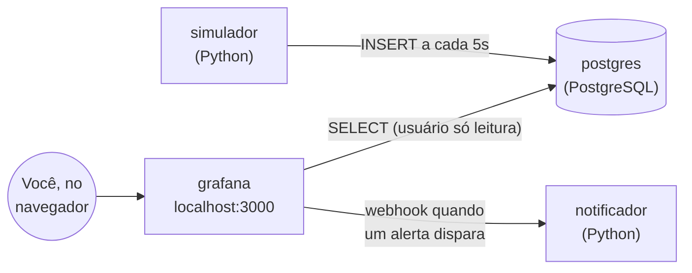

# Cervejaria Byte: monitoramento com Grafana

[](https://github.com/nicolassmotta/grafana-cervejaria/actions/workflows/e2e.yml)

Demonstração do [Grafana](https://grafana.com) para a disciplina **Tópicos em Programação 3 (CC05Z, UTFPR, 2026/2)**.

Uma cervejaria fictícia tem 4 tanques de fermentação e 2 linhas de envase. Um script Python simula os sensores e grava as leituras num PostgreSQL. O Grafana lê esse banco e mostra tudo em tempo real. Quando algum tanque esquenta demais, um alerta dispara e a central de avisos da fábrica é notificada.


> Todos os dados são simulados. A cervejaria, os tanques e os números não existem.

## Material da apresentação

[Slides da apresentação](docs/apresentacao-grafana.pdf): o que é o Grafana, por que e por quem foi criado, quem usa e como ele funciona por dentro, do SQL ao gráfico. O resumo técnico está em [O Grafana por dentro](#o-grafana-por-dentro).

## Arquitetura



| Serviço | O que faz | Onde está o código |
| --- | --- | --- |
| `postgres` | Guarda cadastros (tanques, linhas) e as séries temporais de leituras | [`sql/`](sql/) |
| `simulador` | Gera leituras de temperatura, pressão, pH e produção a cada 5 segundos | [`simulador/`](simulador/) |
| `grafana` | Dashboard, variáveis, anotações e alertas, tudo configurado por arquivo | [`grafana/`](grafana/) |
| `notificador` | Recebe as notificações de alerta do Grafana e mostra no terminal | [`notificador/`](notificador/) |

## Funcionalidades do Grafana demonstradas

- **Fonte de dados SQL:** conexão com PostgreSQL usando um usuário que só pode ler ([`postgres.yml`](grafana/provisioning/datasources/postgres.yml)).
- **Dashboard com vários tipos de painel:** *stat*, *time series* (linhas e barras empilhadas), *gauge*, *table* e *alert list*.
- **Queries SQL com macros do Grafana:** `$__timeFilter` e `$__timeGroupAlias` adaptam a query ao intervalo de tempo escolhido na tela.
- **Variáveis:** o filtro **Tanque** no topo é preenchido por uma query e filtra os painéis.
- **Anotações:** eventos da tabela `eventos` (falhas e normalizações) aparecem como linhas verticais nos gráficos.
- **Thresholds e value mappings:** cores mudam conforme o valor; `0`/`1` viram "DESLIGADA"/"Ligada".
- **Atualização automática:** o dashboard recarrega a cada 5 segundos.
- **Alertas** ([`alertas.yml`](grafana/provisioning/alerting/alertas.yml)):
  - *regra:* avalia os tanques a cada 10 segundos e cria um alerta separado para cada tanque acima do limite;
  - *estado pendente:* o alerta passa 20 segundos em **Pendente** antes de disparar, para ignorar picos isolados;
  - *contact point:* quando dispara ou resolve, o Grafana manda um webhook para o `notificador`. O mesmo mecanismo serve para Slack, Teams, Telegram, e-mail e outros;
  - *política de notificação:* agrupa os avisos por tanque e define de quanto em quanto tempo repetir.
- **Provisionamento (configuração como código):** nada é configurado na mão. Fonte de dados, dashboard e alerta vêm de arquivos versionados no Git.

## O Grafana por dentro

### Por que e por quem foi criado

Em dezembro de 2013, Torkel Ödegaard, desenvolvedor e consultor, tinha as métricas do time no Graphite, mas montar dashboards e escrever queries na tela dele era difícil e demorado. Ele fez um fork do Kibana 3 (que fazia dashboards bons, só que para o Elasticsearch) e trocou a consulta por um editor de queries do Graphite. A v1.0 saiu em 19 de janeiro de 2014. Em 2014, Torkel se juntou a Raj Dutt e Anthony Woods na raintank, a empresa que virou a Grafana Labs. O projeto é open source (AGPL-3.0 desde 2021) e a empresa vive de Grafana Cloud, Enterprise e suporte.

A ideia de origem continua a mesma: a tela fica separada de onde os dados moram. O Grafana não guarda métricas, ele consulta quem guarda.

| Ano | Versão | O que mudou |
| --- | --- | --- |
| 2014 | 1.0 | App que rodava todo no navegador, lendo o Graphite |
| 2015 | 2.0 | Servidor em Go, usuários e banco próprio |
| 2016 | 4.0 | Alertas |
| 2020 | 7.0 | Data frames e transformações |
| 2021 | 8.0 | Alertas unificados, painel Time series com uPlot, licença AGPL-3.0 |
| 2025-26 | 12 e 13 | Dashboards como código (Git Sync, schema v2) |

Fontes: [4 years of Grafana](https://grafana.com/blog/2018/01/30/4-years-of-grafana/), [Grafana Labs at 5](https://grafana.com/blog/2019/10/04/grafana-labs-at-5-how-we-got-here-and-where-were-going), [What's new](https://grafana.com/docs/grafana/latest/whatsnew/), [troca de licença](https://grafana.com/blog/2021/04/20/grafana-loki-tempo-relicensing-to-agplv3/).

### As três peças

| Peça | Feita em | O que faz |
| --- | --- | --- |
| Front-end, no navegador | TypeScript e React | Monta a tela e desenha os painéis. Nunca fala com a fonte de dados. |
| `grafana-server` | Go | API HTTP, login e permissões, execução das queries, motor de alertas e provisionamento. |
| Plugins de fonte de dados | Go (SDK da Grafana) | Sabem falar com cada fonte. Os nativos, como o PostgreSQL daqui, rodam dentro do servidor; os externos rodam em processo separado e conversam com ele por gRPC. |

O servidor também tem um banco interno (SQLite por padrão, MySQL ou PostgreSQL em produção) para usuários, permissões, dashboards e estado dos alertas. As leituras dos tanques nunca entram nele: ficam no PostgreSQL da demo.

### Do SQL ao gráfico

Exemplo real com o painel **Temperatura dos tanques**.

**1. O navegador pede os dados.** Ele manda um `POST /api/ds/query` com o período da tela e as queries do painel (resumido):

```json
{
  "from": "now-30m", "to": "now",
  "queries": [{
    "refId": "A",
    "datasource": { "uid": "cervejaria-pg" },
    "format": "time_series",
    "rawSql": "SELECT $__timeGroupAlias(l.momento, $__interval), ...",
    "maxDataPoints": 918,
    "intervalMs": 5000
  }]
}
```

`maxDataPoints` é a largura do painel em pixels e `intervalMs` vira o `$__interval`: o período dividido pelos pontos, nunca abaixo do mínimo da fonte (`timeInterval: 5s` em [`postgres.yml`](grafana/provisioning/datasources/postgres.yml)). O editor do painel mostra esses dois números como `MD = auto = 918` e `Intervalo = 5s`. O navegador só manda o `uid` da fonte, nunca endereço ou senha.

**2. O servidor expande as macros e consulta o banco.** O SQL que chega ao PostgreSQL:

```sql
SELECT floor(extract(epoch from l.momento)/5)*5 AS "time",
       t.codigo || ' ' || t.estilo AS metric,
       avg(l.temperatura_c) AS value
FROM leituras_tanque l
JOIN tanques t ON t.id = l.tanque_id
WHERE l.momento BETWEEN '2026-10-07T00:58:36.681Z' AND '2026-10-07T01:03:36.681Z'
  AND t.codigo IN ('TQ-02')
GROUP BY 1, 2
ORDER BY 1
```

**3. A resposta volta como data frame.** É uma tabela colunar: cada campo tem nome, tipo e um vetor de valores. A coluna `metric` virou o nome da série, e é assim que uma query só gera uma linha por tanque:

```json
"results": { "A": { "frames": [{
  "schema": {
    "meta": { "type": "timeseries-wide" },
    "fields": [
      { "name": "Time", "type": "time" },
      { "name": "TQ-02 IPA", "type": "number" } ] },
  "data": { "values": [
    [1791334720000, 1791334780000, ...],
    [18.97, 19.03, ...] ] }
}] } }
```

Toda fonte devolve esse mesmo formato, seja SQL, Prometheus ou Loki. Por isso qualquer painel desenha dados de qualquer fonte.

**4. O navegador desenha.** O painel aplica as opções de campo (unidade, decimais, cores, thresholds) e entrega os vetores para a [uPlot](https://github.com/leeoniya/uPlot), a biblioteca que o painel Time series usa desde o Grafana 7.4. Ela pinta num `<canvas>`, não em SVG, e por isso aguenta milhares de pontos com refresh a cada 5 segundos.

Para ver tudo isso ao vivo: editar o painel e clicar em **Inspetor da consulta**. Ou, pelo terminal:

```bash
curl -s -u admin:cervejaria -H 'Content-Type: application/json' \
  -X POST localhost:3000/api/ds/query \
  -d '{"from":"now-5m","to":"now","queries":[{"refId":"A","datasource":{"uid":"cervejaria-pg"},"format":"table","rawSql":"SELECT * FROM tanques"}]}'
```

### O JSON do dashboard

O dashboard inteiro é um documento JSON, o *JSON model*. É isso que o Grafana grava no banco interno quando alguém clica em Salvar, o que se exporta e importa entre instalações, e o que a demo carrega do disco em [`cervejaria.json`](grafana/dashboards/cervejaria.json):

```jsonc
{
  "uid": "cervejaria",                       // vai na URL: /d/cervejaria
  "title": "Cervejaria Byte: Monitoramento da Produção",
  "time": { "from": "now-1h", "to": "now" }, // período padrão
  "refresh": "5s",                           // atualização automática
  "templating": { "list": [ /* variável $tanque */ ] },
  "annotations": { "list": [ /* eventos da fábrica */ ] },
  "panels": [ /* 10 painéis */ ],
  "schemaVersion": 41                        // versão do formato, para migrar arquivos antigos
}
```

Cada painel tem sempre as mesmas partes:

```jsonc
{
  "type": "timeseries",                          // qual visualização desenha
  "title": "Temperatura dos tanques",
  "datasource": { "uid": "cervejaria-pg" },      // qual fonte, só pelo uid
  "targets": [{ "refId": "A", "rawSql": "SELECT $__timeGroupAlias(...)" }], // as consultas
  "fieldConfig": { "defaults": { "unit": "celsius", "decimals": 1 } },        // como formatar
  "options": { "tooltip": { "mode": "multi" } }, // legenda, tooltip
  "gridPos": { "x": 0, "y": 5, "w": 16, "h": 10 } // posição numa grade de 24 colunas; h em blocos de 30 px
}
```

No Grafana 13, o JSON fica em **Editar > Edit as code**, na barra lateral do dashboard. Fonte: [JSON model](https://grafana.com/docs/grafana/latest/visualizations/dashboards/build-dashboards/view-dashboard-json-model/).

## Pré-requisitos

- [Git](https://git-scm.com/downloads)
- [Docker](https://docs.docker.com/get-docker/) com Docker Compose (no Windows e no macOS, o Docker Desktop já inclui os dois)
- Porta **3000** livre

Não é preciso instalar Python, PostgreSQL nem Grafana: cada um roda dentro do seu container.

Para o [teste automatizado](#teste-automatizado), também é preciso `bash`, `curl` e `python3` (Linux, macOS ou WSL no Windows).

## Instalação

```bash
git clone https://github.com/nicolassmotta/grafana-cervejaria.git
cd grafana-cervejaria
docker compose up -d --build
```

Na primeira vez, o Docker baixa as imagens (uns 2 minutos, dependendo da internet). Para conferir se tudo subiu:

```bash
docker compose ps
```

Os quatro serviços devem aparecer como `Up` (o `postgres`, como `healthy`).

## Acesso

Abra **http://localhost:3000/d/cervejaria** e entre com:

| Usuário | Senha |
| --- | --- |
| `admin` | `cervejaria` |

Depois do login, abre o dashboard **Cervejaria Byte: Monitoramento da Produção**. Também dá pra chegar nele pelo menu **Painéis de controle > Cervejaria**. Na primeira execução o simulador gera 6 horas de histórico, então os gráficos já começam preenchidos, inclusive com uma falha passada no TQ-03.

## Testando: simulando uma falha

1. Acompanhe o simulador e a central de avisos em um terminal:

   ```bash
   docker compose logs -f simulador notificador
   ```

2. Em outro terminal, desligue a refrigeração do tanque TQ-02:

   ```bash
   docker compose exec simulador python refrigeracao.py desligar TQ-02
   ```

3. No dashboard, observe:
   - o card **Refrigeração** do TQ-02 fica vermelho na hora;
   - uma linha vertical vermelha (anotação) aparece nos gráficos;
   - a temperatura do TQ-02 sobe cerca de 2,5 °C por minuto;
   - em **cerca de 1 minuto** ela passa de 21 °C, o limite da IPA: o card **Tanques em alerta** vai para 1 e o alerta fica **Pendente** (amarelo) em **Alertas ativos**;
   - 20 segundos depois o alerta **dispara** (vermelho): aparece no menu **Alertas** do Grafana e o terminal do `notificador` mostra:

     ```
     [ALERTA DISPARADO] TQ-02 (IPA) está acima da temperatura máxima
               Excesso atual: 0.9 °C acima do limite. Verifique a refrigeração.
     ```

4. Religue a refrigeração:

   ```bash
   docker compose exec simulador python refrigeracao.py ligar TQ-02
   ```

   A temperatura volta ao normal, o alerta é resolvido em uns 20 segundos e o `notificador` mostra `[ALERTA RESOLVIDO] TQ-02 (IPA) voltou ao normal`.

Para ver o estado de todos os tanques:

```bash
docker compose exec simulador python refrigeracao.py status
```

### Consultando o banco direto

```bash
docker compose exec postgres psql -U cervejaria -c "SELECT * FROM tanques;"
docker compose exec postgres psql -U cervejaria -c "SELECT * FROM leituras_tanque ORDER BY momento DESC LIMIT 8;"
```

## Teste automatizado

O script [`scripts/teste-e2e.sh`](scripts/teste-e2e.sh) faz sozinho todo o roteiro acima e confere cada etapa:

```bash
./scripts/teste-e2e.sh
```

```
==> Serviços
    OK: Grafana respondendo
    OK: simulador gravando leituras no PostgreSQL
==> Provisionamento do Grafana
    OK: fonte de dados conectada ao banco
    OK: dashboard carregado
==> Estado inicial
    OK: alerta do TQ-02 em Normal
==> Simulando falha na refrigeração do TQ-02
    OK: alerta ficou Pendente
    OK: alerta disparou
    OK: notificador recebeu o aviso de alerta disparado
==> Religando a refrigeração do TQ-02
    OK: alerta voltou ao normal
    OK: notificador recebeu o aviso de alerta resolvido

Tudo certo: sensores -> PostgreSQL -> Grafana -> alerta -> notificação.
```

Leva uns 2 minutos, não apaga dados e pode ser rodado várias vezes seguidas. O mesmo teste roda no GitHub Actions a cada push ([`e2e.yml`](.github/workflows/e2e.yml)); o selo no topo deste README mostra o resultado mais recente.

## Configuração

As variáveis ficam no [`docker-compose.yml`](docker-compose.yml):

| Variável | Serviço | Padrão | Descrição |
| --- | --- | --- | --- |
| `INTERVALO_SEGUNDOS` | simulador | `5` | Intervalo entre leituras |
| `HORAS_HISTORICO` | simulador | `6` | Horas de dados passados geradas na primeira execução |
| `GF_SECURITY_ADMIN_PASSWORD` | grafana | `cervejaria` | Senha do usuário `admin` |
| `GF_USERS_DEFAULT_LANGUAGE` | grafana | `pt-BR` | Idioma da interface |

Os limites de temperatura de cada tanque estão em [`sql/02_dados_iniciais.sql`](sql/02_dados_iniciais.sql).

Depois de mudar o `docker-compose.yml`, rode `docker compose up -d --build` de novo. Para mudar os arquivos de `sql/` é preciso recriar o banco (veja abaixo).

> As senhas estão fixas no arquivo porque é uma demo local. Em produção, use variáveis de ambiente ou um gerenciador de segredos.

## Parando e recomeçando

```bash
docker compose down      # para tudo e mantém os dados
docker compose down -v   # para tudo e APAGA os dados (o próximo "up" recomeça do zero)
```

## Estrutura do projeto

```
grafana-cervejaria/
├── docker-compose.yml               # os quatro serviços
├── sql/                             # rodam sozinhos na 1ª inicialização do banco
│   ├── 01_schema.sql                # tabelas
│   ├── 02_dados_iniciais.sql        # tanques e linhas de envase
│   └── 03_usuario_grafana.sql       # usuário só leitura para o Grafana
├── simulador/
│   ├── simulador.py                 # gera as leituras
│   ├── refrigeracao.py              # liga/desliga a refrigeração (simula falhas)
│   ├── requirements.txt
│   └── Dockerfile
├── notificador/
│   ├── notificador.py               # recebe o webhook de alerta do Grafana
│   └── Dockerfile
├── docs/                            # slides e print do dashboard
├── scripts/teste-e2e.sh             # teste de ponta a ponta
├── .github/workflows/e2e.yml        # roda o teste a cada push
└── grafana/
    ├── provisioning/
    │   ├── datasources/postgres.yml  # conexão com o banco
    │   ├── dashboards/dashboards.yml # onde procurar dashboards
    │   └── alerting/alertas.yml      # regra, contact point e política
    └── dashboards/cervejaria.json   # o dashboard
```

## Problemas comuns

- **`port is already allocated`:** outro programa está usando a porta 3000. Pare esse programa ou troque a porta da esquerda no `docker-compose.yml` (ex.: `"3001:3000"` e acesse `localhost:3001`).
- **Dashboard vazio:** confira se o simulador está rodando com `docker compose logs simulador`.
- **Gráficos com um buraco no meio:** o ambiente ficou parado e o simulador não grava enquanto está desligado. Para recomeçar com 6 horas de histórico novinho, rode `docker compose down -v` e `docker compose up -d`.
- **Mudei um arquivo de `sql/` e nada aconteceu:** esses scripts só rodam quando o banco é criado. Rode `docker compose down -v` e depois `docker compose up -d`.

## Versões

Grafana 13.2.2 · PostgreSQL 18.6 · Python 3.13 · psycopg 3.3.6
