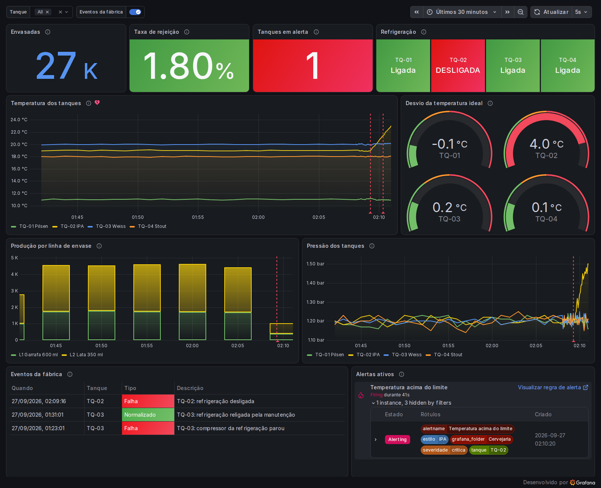
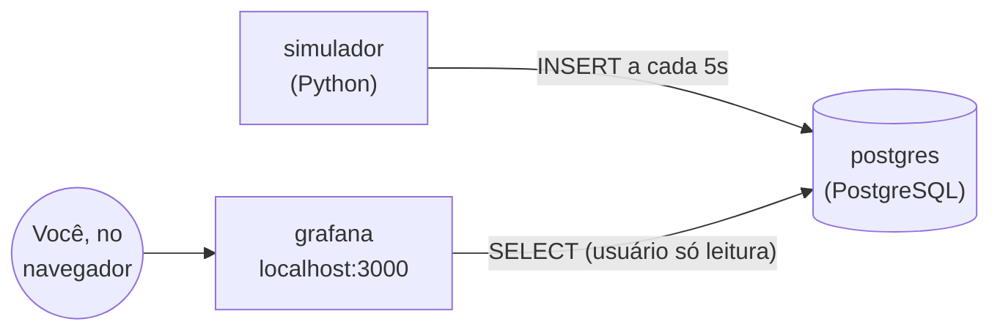

# Cervejaria Byte: monitoramento com Grafana

Demonstração do [Grafana](https://grafana.com) para a disciplina **Tópicos em Programação 3 (CC05Z, UTFPR, 2026/2)**.

Uma cervejaria fictícia tem 4 tanques de fermentação e 2 linhas de envase. Um script Python simula os sensores e grava as leituras num PostgreSQL. O Grafana lê esse banco e mostra tudo em tempo real, com um alerta que dispara quando algum tanque esquenta demais.



> Todos os dados são simulados. A cervejaria, os tanques e os números não existem.

## Arquitetura



| Serviço | O que faz | Onde está o código |
| --- | --- | --- |
| `postgres` | Guarda cadastros (tanques, linhas) e as séries temporais de leituras | [`sql/`](sql/) |
| `simulador` | Gera leituras de temperatura, pressão, pH e produção a cada 5 segundos | [`simulador/`](simulador/) |
| `grafana` | Dashboard, variáveis, anotações e alertas, tudo configurado por arquivo | [`grafana/`](grafana/) |

## Funcionalidades do Grafana demonstradas

- **Fonte de dados SQL:** conexão com PostgreSQL usando um usuário que só pode ler ([`postgres.yml`](grafana/provisioning/datasources/postgres.yml)).
- **Dashboard com vários tipos de painel:** *stat*, *time series* (linhas e barras empilhadas), *gauge*, *table* e *alert list*.
- **Queries SQL com macros do Grafana:** `$__timeFilter` e `$__timeGroupAlias` adaptam a query ao intervalo de tempo escolhido na tela.
- **Variáveis:** o filtro **Tanque** no topo é preenchido por uma query e filtra os painéis.
- **Anotações:** eventos da tabela `eventos` (falhas e normalizações) aparecem como linhas verticais nos gráficos.
- **Thresholds e value mappings:** cores mudam conforme o valor; `0`/`1` viram "DESLIGADA"/"Ligada".
- **Atualização automática:** o dashboard recarrega a cada 5 segundos.
- **Alertas:** uma regra avalia os tanques a cada 10 segundos e cria um alerta por tanque acima do limite ([`alertas.yml`](grafana/provisioning/alerting/alertas.yml)).
- **Provisionamento (configuração como código):** nada é configurado na mão. Fonte de dados, dashboard e alerta vêm de arquivos versionados no Git.

## Pré-requisitos

- [Git](https://git-scm.com/downloads)
- [Docker](https://docs.docker.com/get-docker/) com Docker Compose (no Windows e no macOS, o Docker Desktop já inclui os dois)
- Portas **3000** e **5432** livres

Não é preciso instalar Python, PostgreSQL nem Grafana: cada um roda dentro do seu container.

## Instalação

```bash
git clone https://github.com/nicolassmotta/grafana-cervejaria.git
cd grafana-cervejaria
docker compose up -d --build
```

Na primeira vez, o Docker baixa as imagens (uns 2 minutos, dependendo da internet). Para conferir se tudo subiu:

```bash
docker compose ps
```

Os três serviços devem aparecer como `Up` (o `postgres`, como `healthy`).

## Acesso

Abra **http://localhost:3000/d/cervejaria** e entre com:

| Usuário | Senha |
| --- | --- |
| `admin` | `cervejaria` |

Depois do login, abre o dashboard **Cervejaria Byte: Monitoramento da Produção**. Também dá pra chegar nele pelo menu **Painéis de controle > Cervejaria**. Na primeira execução o simulador gera 6 horas de histórico, então os gráficos já começam preenchidos, inclusive com uma falha passada no TQ-03.

## Testando: simulando uma falha

1. Acompanhe o simulador em um terminal:

   ```bash
   docker compose logs -f simulador
   ```

2. Em outro terminal, desligue a refrigeração do tanque TQ-02:

   ```bash
   docker compose exec simulador python refrigeracao.py desligar TQ-02
   ```

3. No dashboard, observe:
   - o card **Refrigeração** do TQ-02 fica vermelho na hora;
   - uma linha vertical vermelha (anotação) aparece nos gráficos;
   - a temperatura do TQ-02 sobe cerca de 2,5 °C por minuto;
   - em **cerca de 1 minuto** ela passa de 21 °C, o limite da IPA, e o alerta dispara: aparece em **Alertas ativos**, em **Tanques em alerta** e no menu **Alertas** do Grafana.

4. Religue a refrigeração:

   ```bash
   docker compose exec simulador python refrigeracao.py ligar TQ-02
   ```

   A temperatura volta ao normal e o alerta é resolvido em uns 20 segundos.

Para ver o estado de todos os tanques:

```bash
docker compose exec simulador python refrigeracao.py status
```

### Consultando o banco direto

```bash
docker compose exec postgres psql -U cervejaria -c "SELECT * FROM tanques;"
docker compose exec postgres psql -U cervejaria -c "SELECT * FROM leituras_tanque ORDER BY momento DESC LIMIT 8;"
```

## Configuração

As variáveis ficam no [`docker-compose.yml`](docker-compose.yml):

| Variável | Serviço | Padrão | Descrição |
| --- | --- | --- | --- |
| `INTERVALO_SEGUNDOS` | simulador | `5` | Intervalo entre leituras |
| `HORAS_HISTORICO` | simulador | `6` | Horas de dados passados geradas na primeira execução |
| `GF_SECURITY_ADMIN_PASSWORD` | grafana | `cervejaria` | Senha do usuário `admin` |
| `GF_USERS_DEFAULT_LANGUAGE` | grafana | `pt-BR` | Idioma da interface |

Os limites de temperatura de cada tanque estão em [`sql/02_dados_iniciais.sql`](sql/02_dados_iniciais.sql).

Depois de mudar o `docker-compose.yml`, rode `docker compose up -d --build` de novo. Para mudar os arquivos de `sql/` é preciso recriar o banco (veja abaixo).

> As senhas estão fixas no arquivo porque é uma demo local. Em produção, use variáveis de ambiente ou um gerenciador de segredos.

## Parando e recomeçando

```bash
docker compose down      # para tudo e mantém os dados
docker compose down -v   # para tudo e APAGA os dados (o próximo "up" recomeça do zero)
```

## Estrutura do projeto

```
grafana-cervejaria/
├── docker-compose.yml               # os três serviços
├── sql/                             # rodam sozinhos na 1ª inicialização do banco
│   ├── 01_schema.sql                # tabelas
│   ├── 02_dados_iniciais.sql        # tanques e linhas de envase
│   └── 03_usuario_grafana.sql       # usuário só leitura para o Grafana
├── simulador/
│   ├── simulador.py                 # gera as leituras
│   ├── refrigeracao.py              # liga/desliga a refrigeração (simula falhas)
│   ├── requirements.txt
│   └── Dockerfile
└── grafana/
    ├── provisioning/
    │   ├── datasources/postgres.yml  # conexão com o banco
    │   ├── dashboards/dashboards.yml # onde procurar dashboards
    │   └── alerting/alertas.yml      # regra de alerta
    └── dashboards/cervejaria.json   # o dashboard
```

## Problemas comuns

- **`port is already allocated`:** outro programa está usando a porta 3000 ou 5432. Pare esse programa ou troque a porta da esquerda no `docker-compose.yml` (ex.: `"3001:3000"` e acesse `localhost:3001`).
- **Dashboard vazio:** confira se o simulador está rodando com `docker compose logs simulador`.
- **Mudei um arquivo de `sql/` e nada aconteceu:** esses scripts só rodam quando o banco é criado. Rode `docker compose down -v` e depois `docker compose up -d`.

## Versões

Grafana 13.2.2 · PostgreSQL 18.6 · Python 3.13 · psycopg 3.3.6
